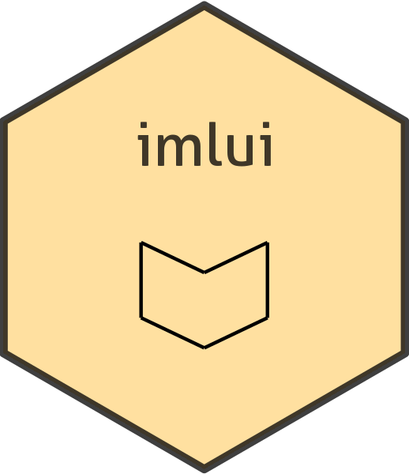

# IML-UI 

<!-- badges: start -->
[](https://github.com/toscm/imlui/actions)
[](https://app.codecov.io/gh/toscm/imlui?branch=main)
[](https://cran.r-project.org/package=imlui)
<!-- badges: end -->

A user interface (UI) for Interpretable Machine Learning (IML) methods.

## Table of Contents

- [Table of Contents](#table-of-contents)
- [Purpose](#purpose)
- [Installation](#installation)
- [Documentation](#documentation)
  - [Important Paths](#important-paths)
  - [Configuration](#configuration)
  - [Data Storage](#data-storage)
  - [User Authentication](#user-authentication)
  - [User Authorization](#user-authorization)
  - [External User Authorization](#external-user-authorization)
- [Frequently Asked Questions (FAQ)](#frequently-asked-questions-faq)
  - [How to add new datasets?](#how-to-add-new-datasets)
  - [How to merge user accounts?](#how-to-merge-user-accounts)
  - [What happens when the imlui server is started?](#what-happens-when-the-imlui-server-is-started)
  - [What happens when a user connects to the imlui server?](#what-happens-when-a-user-connects-to-the-imlui-server)
- [Developer Guideline](#developer-guideline)
  - [Variables Naming Conventions](#variables-naming-conventions)
- [UI Layout](#ui-layout)
  - [How to submit to CRAN?](#how-to-submit-to-cran)

## Purpose

Over the last three decades dozens of research papers have proposed different classification methods for Diffuse Large B-Cell Lymphoma (DLBCL). The goal of this app is to implement all these methods and to provide a unified interface for applying, interpreting and comparing them.

## Installation

For Installation as standalone app in Windows, Linux or Mac, see [Installation](INSTALLATION.md). For installation as R-package, run one of the following commands:

```R
# From CRAN (stable version)
install.packages("imlui")
# From Github (development version)
devtools::install_github("toscm/imlui")
```

## Documentation

### Important Paths

In this documentation the directories `IMLUI_PACKAGE_DIR`, `IMLUI_CONFIG_DIR` and `IMLUI_DATA_DIR` and the file `IMLUI_CONFIG` are referenced. Their exact path depends on the used operating system as well as other environment settings. The algorithm to determine their exact paths is as follows:

TODO

### Configuration

All configuration options for `imlui` live in a single configuration file `imlui_config.yml`. The following directories are checked for `imlui_config.yml`:

1. The directory specified by commandline parameter `--config-file`
2. The current working directory
3. $IMLUI_CONFIG_DIR/
4. $XDG_CONFIG_HOME/imlui/
5. $HOME/.config/imlui/
6. $USERPROFILE/.config/imlui/

If multiple `imlui_config.yml` files exist, only the first one is used. If no `imlui.yml` can be found, a new file `imlui_config.yml` is created at the first directory from above, that already exists. Checking for existence is done in the same order as listed above, except for option 2 (the current working directory), which is checked last (and acts as a last fallback, because it always exists).

For an example configuration file see [inst/assets/yml/imlui_config.yml](inst/assets/yml/imlui_config.yml).

### Data Storage

Imlui uses a relational database system for storing all information except raw datasets. Supported database types are [PostgreSQL](https://www.postgresql.org/) (recommended for multi user instances) and [SQLite](https://www.sqlite.org/index.html) (default for local usage). The corresponding database type, hostname, port, username and password must be specified in file `imlui_config.yml`, section `database` (see [Configuration](#configuration) for details). If no `database` configuration is provided, a new SQLite database is created at `<IMLUI_DATA_DIR>/imlui_database.sqlite`.

For storing raw datasets, imlui uses a [datatomb](https://gitlab.spang-lab.de/containers/datatomb/) server like <data.spang-lab.de>. The server URL, server port and the access token to be used for the connection must be specified in file `imlui_config.yml` section `datatomb_server` . If no `datatomb_server` configuration is provided, a new datatomb server is started at `localhost:4141`.

### User Authentication

Imlui supports classic user/password authentication as well as authentication via OpenID Connect, i.e. the option to *Sign in with Google/Github/Facebook etc*. Currently supported OpenID Connect providers are: [auth.spang-lab.de](https://auth.spang-lab.de/), [gitlab.spang-lab.de](https://gitlab.spang-lab.de/), [github.de](https://github.com/), [google.com](https://www.google.com/), [facebook.com](https://www.facebook.com/) and [twitter.com](https://twitter.com/). Should you opt for authentication via OpenID Connect, at least a unique ID will be retrieved from the respective identity provider. If available, your name, email and profile picture will be retrieved as well.

### User Authorization

By default, user authorization, i.e. the management of user permissions, is handled by imlui directly. For information on how to configure an external identity provider as authorization source, please refer to section [External User Authorization]. Imlui's internal authorization mechanism works as follows: for each user an entry is created in table `users`¹ after the user's first login. Permission to access specific datasets/services, is stored as a property of the dataset/service in table `dataset_permissions`/`resource_permissions`². Example: it is possible to grant `use` access for dataset `Lenz_2008_train` to groups `spang-lab-phd-students` and `spang-lab-master-students` and to grant `download` access to group `imlui-admins` and user `uid12345`.

¹ Columns of table `users` are `user_id`, `google_id`, `github_id`, `email`, `password`, `name`, ...
² Columns of table `dataset_permissions`/`resource_permissions` are `dataset_id`/`resource_id` and `permission_id`. Possible values for `permission_id` are: `list`, `view` and `download`. Side-note: there is no `write` or `change` permissions, because datasets are immutable objects. If anything has to be changed, that new dataset must obtain a different ID.

### External User Authorization

Imlui can be configured to use an external identity provider such as [auth.spang-lab.de](https://auth.spang-lab.de/) for authorization. This is implemented as follows: when user `uidX` logs in via identity provider `authY.com`, then

1. All groups `G={g1, g2, ...}` assigned to `uidX` are retrieved from `authY.com`
2. New rows
   * `group_id=g1, user_id=uidX, granted_by=authY.com`
   * `group_id=g2, user_id=uidX, granted_by=authY.com`
   * `...`
   are added to table `groups`, if they don't exist yet.
3. All rows matching `group_id=.*, user_id=uidX, granted_by=authY.com` are retrieved from table `users`. If any `group_id` is found, that is no longer an element of `G`, those entries are removed.

This way, access to resources can be given to groups defined by `authY.com` and whenever a user signs in via `authY.com` he automatically is added to those groups (or removed from them).

To enable autorization via an external identity provider, login as admin and go to `Settings` > `Authorization` > `Enabled external authorization providers` and tick the checkbox of the external identity provider you want to enable.

## Frequently Asked Questions (FAQ)

### How to add new datasets?

There are currently three different ways to add new datasets to imlui. Method 1 and 2 require access to `imlui_config.yml` (see section [Configuration](#configuration)), i.e. they are only available for imlui hosters, but not for mere imlui users. Method 3 requires a user to upload its dataset into imlui's data storage. Therefore, if you are prohibited by law from uploading your data to third-party servers, hosting your own imlui instance might be your only option. For details regarding imlui's security mechanisms for protecting your data please see section [Data Storage](#data-storage).

### How to merge user accounts?

If a user logs in via different authentication mechanisms, e.g. once via *Sign in with Google* and once via *Sign in with username/password* two seperate accounts are created. In the followin we assume, that the first created account has received user ID *uid1* and the second account has received user ID *uid2*. To merge those accounts later on, login as uid1 and click on `Settings` > `Profile` > `Merge Account`. Then enther uid2 as ID of your second user account. Afterwards you will be prompted to login via the preferred login method of uid2. After completing the login process, your two accounts will be merged, i.e:

1. All permissions granted to uid2 will be granted to uid1
2. All profile information available for uid2, but missing for uid1, will be copied to uid1
3. Profile information that is different between uid1 and uid2, will be kept as is, unless checkbox *overwrite current profile information* was checked (in this case the version from uid2 will be used to overwrite the uid1 version)
4. The entry for uid2 in table `users` gets deleted.

### What happens when the imlui server is started?

TODO

### What happens when a user connects to the imlui server?

TODO

## Developer Guideline

### Variables Naming Conventions

```txt
M  <- Vector of Model Names                         [lamis,             tric,            ...]
MF  <- List of Vectors of Feature Names             [lamis=(MYC, BCR1), tric=(ABC, DEF), ...]
MP  <- List of Vectors of Parameter Values          [lamis=(0.1, -1.3), tric=(2, 3),     ...]
D   <- Vector of Dataset Names                      [lamis_test,             lamis_train,             ...]
DS  <- List of Vectors of Sample Names              [lamis_test=(s1, s2),    lamis_train=(a1, a2),    ...]
DF  <- List of Vectors of Feature Names             [lamis_test=(ABC, BCL2), lamis_train=(ABC, BCL2), ...]
DX  <- List of Dataframes of covariate values       [lamis_test= data.frame(ABC=c(s1=2, s2=3), BCL2=c(a1=3, a2=4)), .]
MDY <- Dataframe of Dataframes of prediction values
 ___________________________________________
|       | (Models)lamis_test1 | tric_train  |
|_______|_____________________| ____________|
|(Data- |  _________________  |  _________  |
| sets) | |  | classA|classB| | |   | A| B| |
|       | |s1| 0.7   |0.3   | | |x12| 0| 1| |
|lamis  | |s2| 0.2   |0.8   | | |x14| 0| 1| |
|       | |_________________| | |_________| |
|       |  _________________  |  _________  |
| tric  | |  | Score        | | |   | Sc. | |
|       | |s1|   122        | | |x12|  40 | |
|       | |s2|    88        | | |x14|  30 | |
|       | |_________________| | |_________| |
|_______|_____________________|_____________|
```

## UI Layout

```txt
x Page
  x Sidebar
    i Models Menu (MM)
    i Datasets Menu (DD)
    o Plot Area Size Widget (PAS_W)
    o App Info Text Output (AI_TO)
    i Clear Cache Button (CC_B)
    i Redraw Button (R_B)
  x+ Mainpanel Tab
    o+ Database Overview Tab (DBO_T)
      o Papers (DBO_PA_T)
      o Models (DBO_MO_T)
      o Datasets (DBO_DS_T)
      o Settings (DBO_SE_T)
      o Samples (DBO_SA_T)
      o Datatypes (DBO_DT_T)
      o Methods (DBO_ME_T)
      o Platforms (DBO_PF_T)
    o+ Data Analysis Tab (DA_T)
      o Descriptions Tab (DA_DD_TO)  [1, 4]
      o MSD-Plot Tab (DA_MSDP_T) [2]
      o ***
    o+ Model Analysis Tab (MA_T)
      o Descriptions Tab (MA_MD_TO) [1]
      o Predictions Tab (MA_MP_T) [5]
      o Survival Curves Tab (MA_SC_T)
      o Feature Effect Plot Tab (MA_FE_T) [6]
    o Session Info Tab (SI_TO) [1]
```

* x: Neither input nor output ID
* i: Displays and provides a input ID
* o: Displays and requires a output ID
* +: Current Selection of subtabs is given through `<outputID>_CS`, e.g. `MP_CS`, `DBO_T_CS`, `DA_T_CS`, `MA_T_CS`
* [1] TODO: Currently implemented as Text Output. Make similar to other tabs.
* [2] TODO: Renamed to 'Numerical Features'
* [4] TODO: Rename to Overview. Add options to display as description or corner matrix with dynamic 'n'.
* [5] TODO: Rename ID to MA_P_T
* [6] TODO: Renamed ID to MA_FEP_T

### How to submit to CRAN?

According to <https://r-pkgs.org/release.html> the following steps are necessary

```R
devtools::document() # Update documentation
rcmdcheck::rcmdcheck( # Run `R CMD check` for this package
    args=c("--no-manual", "--as-cran"),
    build_args=c("--no-manual"),
    check_dir="check"
)
devtools::revdep() # Run `R CMD check` for all dependencies
devtools::spell_check() # Check spelling of package
devtools::release() # Builds, tests and submits the package to CRAN.
# Manual submission can be done at: https://cran.r-project.org/submit.html
```
